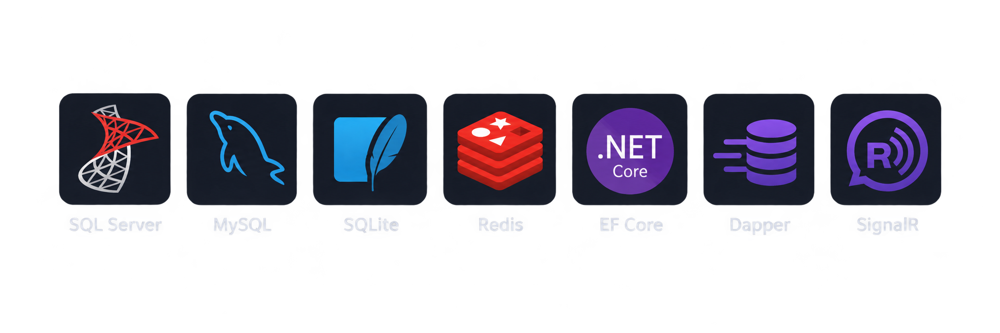

 

---

## 👨‍💻 About
Backend-focused developer building APIs and systems with **ASP.NET Core, C#, Laravel, and PHP**.

I care about more than making code work — I focus on **architecture, data, performance, maintainability, and the engineering decisions behind a system**. I also have practical frontend experience with Angular and JavaScript, allowing me to work across the full stack when needed.

Recent work includes production-oriented backend systems, a **.NET graduation project**, and leading backend development for **ThreeDOS**, a student technical organization.

Currently deepening my knowledge in **backend architecture, distributed systems, scalability, real-time systems, and production engineering**.

---

## 🎯 Currently

- 🔭 **Primary Focus** — Backend Engineering with .NET & Laravel
- 🧠 **Deepening** — System Design · Scalability · Distributed Systems
- ⚡ **Exploring** — Go · gRPC · Concurrency · Redis · Production Patterns
- 🛠️ **Building** — Backend projects focused on real-world engineering problems
- 🎯 **Direction** — Backend Engineering · Fintech · Scalable Systems

---

## 🧰 Tech Arsenal

### Backend Engineering

`C# · ASP.NET Core · PHP · Laravel · Go · FastAPI`

### Frontend & API Consumption

`HTML · CSS · JavaScript · TypeScript · Angular · Bootstrap · Tailwind`

### Data & Real-Time

### Cloud & Tooling

`Azure · Docker · Git · GitHub · VS Code · Visual Studio · Postman · Swagger`

---

## 🚀 Featured Projects

### 🎟️ EpicHub — Event Management & Ticketing Platform

Production-oriented event management and vendor marketplace built as my **graduation project**.

- 🏗️ **Clean Architecture** with modular backend design and YARP API gateway
- ⚡ **Redis-backed hybrid caching** and Hangfire background jobs
- 💳 **Paymob payments** with HMAC-verified webhooks and idempotency
- ✨ **AI-powered** budget and recommendation features
- 📊 **OpenTelemetry** observability and Azure deployment via GitHub Actions

---

### 🏛️ ThreeDOS APIs — Council Management System

Backend-only, API-first management system built for student councils and training organizations during my time as **Backend Development Head at ThreeDOS**.

- 🛡️ **Council-scoped RBAC** with data isolation
- ✅ **Task assignment**, submission tracking, and attendance management
- 👥 **Team and member management** with bulk import
- 🤖 **Gemini-powered AI mentor** for guidance
- 🏗️ **Layered architecture**: Controllers → Requests → Services → Repositories → Policies → Resources

---

## 📦 Also Shipped

<table>
<tr>

<td width="33%" valign="top">

#### 📅 ThreeDOS Ushering System

`Laravel` · `MySQL` · `JavaScript`

The ThreeDOS Ushering & Candidate Management System is a robust, platform engineered to streamline member recruitment, event ushering attribution, interview evaluations, candidate decision pipelines, and executive performance analytics across all ThreeDOS.

</td>

<td width="33%" valign="top">

#### 🍔 Food Delivery System

`ASP.NET Core` · `EF Core` · `SQL Server`

Online ordering platform with live order tracking and admin dashboard.

</td>

<td width="33%" valign="top">

#### 💼 Job Portal

`Laravel` · `MySQL` · `JavaScript`

Connects job seekers and employers with auth, role management, search, and resume upload.

</td>

</tr>
</table>

---

## 🎓 Leadership & Experience

### ThreeDOS — Backend Development Head

ThreeDOS was a **student technical organization** where I progressed through multiple roles before becoming **Backend Development Head**.

The role involved more than writing backend code — it included **technical ownership, task decomposition, mentoring, architectural decisions, reviewing implementations, and coordinating backend development**.

This experience helped me move from implementing individual features toward thinking about **systems, people, trade-offs, and delivery as a whole**.

---

## 🧭 Engineering Direction

I'm currently focused on progressing from backend development toward **advanced backend and system engineering**.

**Areas I'm actively exploring:**

- 🏗️ System design and architecture
- 🔌 API design and distributed systems
- 🗄️ Database design and performance
- ⚡ Caching and Redis
- ⚖️ Load balancing and API gateways
- 📬 Background processing and messaging
- 📡 Real-time communication
- 🧵 Concurrency and Go
- 🔗 gRPC and service-to-service communication
- 📊 Observability and production engineering
- ☁️ Cloud deployment and scalability

> The goal isn't simply to learn more technologies — it's to become better at **understanding constraints, evaluating trade-offs, and designing systems that work in the real world**.

---

## 📈 Activity & Stats

 

---

## 📬 Let's Connect

---

